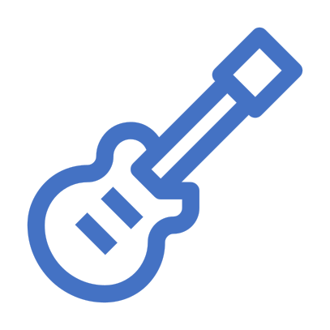

# Music-Engine


<!-- PROJECT SHIELDS -->
<!--
*** I'm using markdown "reference style" links for readability.
*** Reference links are enclosed in brackets [ ] instead of parentheses ( ).
*** See the bottom of this document for the declaration of the reference variables
*** for contributors-url, forks-url, etc. This is an optional, concise syntax you may use.
*** https://www.markdownguide.org/basic-syntax/#reference-style-links
-->
[![Forks][forks-shield]][forks-url]
[![Stargazers][stars-shield]][stars-url]
[![Issues][issues-shield]][issues-url]


<!-- PROJECT LOGO -->
<br />
<div align="center">
  <a href="https://github.com/GEI-Software/Music-Engine">
    
  </a>

<h3 align="center">Music Engine</h3>

  <p align="center">
    Creation of a system that automatizes the renting of music studios, music materials and technical staff, and facilitates and improves the work of Music Engine S.L.
    <br />
    <a href="https://github.com/GEI-Software/Music-Engine"><strong>Explore the docs »</strong></a>
    <br />
    <br />
    <a href="https://github.com/GEI-Software/Music-Engine">View Demo</a>
    ·
    <a href="https://github.com/GEI-Software/Music-Engine/issues">Report Bug</a>
    ·
    <a href="https://github.com/GEI-Software/Music-Engine/issues">Request Feature</a>
  </p>
</div>


<!-- TABLE OF CONTENTS -->
<details>
  <summary></summary>
  <ol>
    <li>
      <a href="#about-the-project">About The Project</a>
      <ul>
        <li><a href="#built-with">Built With</a></li>
      </ul>
    </li>
    <li>
      <a href="#getting-started">Getting Started</a>
      <ul>
        <li><a href="#prerequisites">Prerequisites</a></li>
        <li><a href="#installation">Installation</a></li>
      </ul>
    </li>
    <li><a href="#usage">Usage</a></li>
    <li><a href="#roadmap">Roadmap</a></li>
    <li><a href="#contributing">Contributing</a></li>
    <li><a href="#license">License</a></li>
    <li><a href="#contact">Contact</a></li>
    <li><a href="#acknowledgments">Acknowledgments</a></li>
  </ol>
</details>


<!-- Comandos Git -->
## Comando per Git
* Create a branch (manualment desde GitHub)
* git pull (actualitzar tot el repositori)
* git checkout name_of_branch (canviar de rama)
* git checkout (comprobar en quina rama estem treballant)
* exemple: git checkout develop-branch
* treballar en els arxius
* git add -A
* git commit -m "Missatge Commit"
* git push


<!-- ABOUT THE PROJECT -->
## About The Project

[![Product Name Screen Shot][product-screenshot]](https://example.com)

Our project involves creating an application for Music Engine S.L, with the main goal of developing an automated system. The purpose of this system is to streamline processes and improve efficiency within the company.
`GEI-Software`, `Music-Engine`, `email`, `Music Engine`, `project_description`

<p align="right">(<a href="#readme-top">back to top</a>)</p>


### Built With
* Python
* FrameWork - Django

<p align="right">(<a href="#readme-top">back to top</a>)</p>

### For use our application

1. Clone the repo
   ```sh
   git clone https://github.com/GEI-Software/Music-Engine
   ```

<p align="right">(<a href="#readme-top">back to top</a>)</p>


<!-- ROADMAP -->
## Roadmap

- [ ] Feature 1
- [ ] Feature 2
- [ ] Feature 3
 

See the [open issues](https://github.com/GEI-Software/Music-Engine/issues) for a full list of proposed features (and known issues).


<!-- LICENSE -->
## License

Distributed under the MIT License. See `LICENSE` for more information.

<p align="right">(<a href="#readme-top">back to top</a>)</p>


<!-- CONTACT -->
## Contact

Zihan - zc3@alumnes.udl.cat

Pau - pte1@alumnes.udl.cat

Ibrahim - imb8@alumnes.udl.cat

Theo - tml2@alumnes.udl.cat

Project Link: [https://github.com/GEI-Software/Music-Engine](https://github.com/GEI-Software/Music-Engine)

<p align="right">(<a href="#readme-top">back to top</a>)</p>


<!-- MARKDOWN LINKS & IMAGES -->
<!-- https://www.markdownguide.org/basic-syntax/#reference-style-links -->
[forks-shield]: https://img.shields.io/github/forks/GEI-Software/Music-Engine.svg?style=for-the-badge
[forks-url]: https://github.com/GEI-Software/Music-Engine/network/members
[stars-shield]: https://img.shields.io/github/stars/GEI-Software/Music-Engine.svg?style=for-the-badge
[stars-url]: https://github.com/GEI-Software/Music-Engine/stargazers
[issues-shield]: https://img.shields.io/github/issues/GEI-Software/Music-Engine.svg?style=for-the-badge
[issues-url]: https://github.com/GEI-Software/Music-Engine/issues
[product-screenshot]: images/screenshot.png
[Next.js]: https://img.shields.io/badge/next.js-000000?style=for-the-badge&logo=nextdotjs&logoColor=white
[Next-url]: https://nextjs.org/
[React.js]: https://img.shields.io/badge/React-20232A?style=for-the-badge&logo=react&logoColor=61DAFB
[React-url]: https://reactjs.org/
[Vue.js]: https://img.shields.io/badge/Vue.js-35495E?style=for-the-badge&logo=vuedotjs&logoColor=4FC08D
[Vue-url]: https://vuejs.org/
[Angular.io]: https://img.shields.io/badge/Angular-DD0031?style=for-the-badge&logo=angular&logoColor=white
[Angular-url]: https://angular.io/
[Svelte.dev]: https://img.shields.io/badge/Svelte-4A4A55?style=for-the-badge&logo=svelte&logoColor=FF3E00
[Svelte-url]: https://svelte.dev/
[Laravel.com]: https://img.shields.io/badge/Laravel-FF2D20?style=for-the-badge&logo=laravel&logoColor=white
[Laravel-url]: https://laravel.com
[Bootstrap.com]: https://img.shields.io/badge/Bootstrap-563D7C?style=for-the-badge&logo=bootstrap&logoColor=white
[Bootstrap-url]: https://getbootstrap.com
[JQuery.com]: https://img.shields.io/badge/jQuery-0769AD?style=for-the-badge&logo=jquery&logoColor=white
[JQuery-url]: https://jquery.com 
[python-url]: https://www.pinclipart.com/picdir/middle/534-5345877_python-logo-clipart.png
